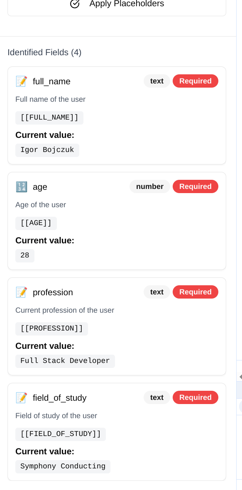

# Document Editor

## Overview

This is a an AI document editor that allows a user to upload a document, identify the fields in the document, and then fill them in with [[PLACEHOLDER]]. Except that it's broken.

## Tasks

Your task is to fix it.

## Requirements

- A user can upload any docx document and have it render in the tool.
- When the user clicks "Analyze Document," the AI Agent should scan the document and identify any fields that need to be populated or are already populated.
- After analyzing, the user should be able to click a button to add [[PLACEHOLDER]], where all the answers should be placed. If there's an existing answer, it should be replaced.

## Update
- One fix necessary in this case was prompt correction as GPT would output markdown ``` decorators. Politely asking it not to, resolved the issue.
- If the actual values were present in the text and detected by NER, they would not get picked up by regex and replaced, fixed that by also returning current value from OpenAI and expanding the replacement script


- added test_doc.docx for testing